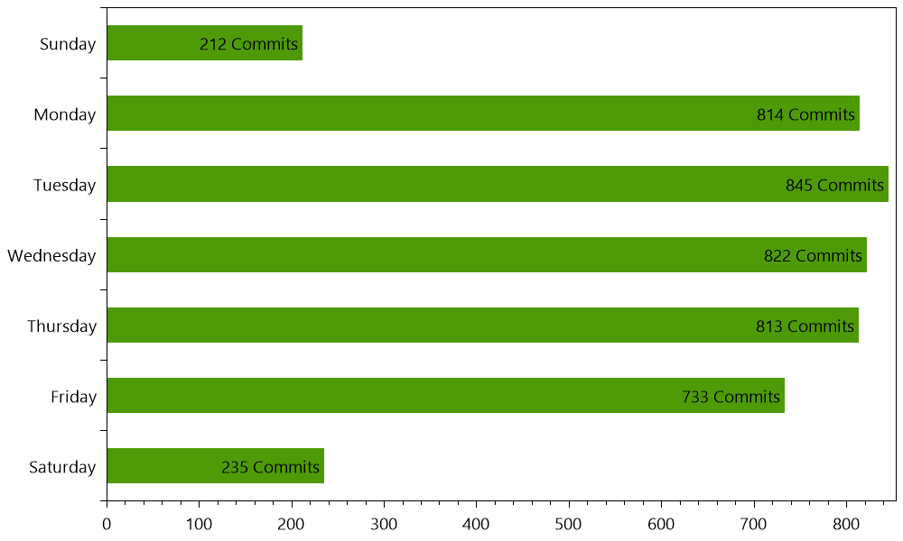

## Github Organization Statistic

```csharp
var github = new Github(new LoginInfo {
    User = "wk-j",
    Token = "...",
    Organization = "..."
});

var repos = github.GetRepositories();
var chart = new GithubPlot().PlotCommitDays(repos);
File.Copy(chart, "__Chart.png");
```

